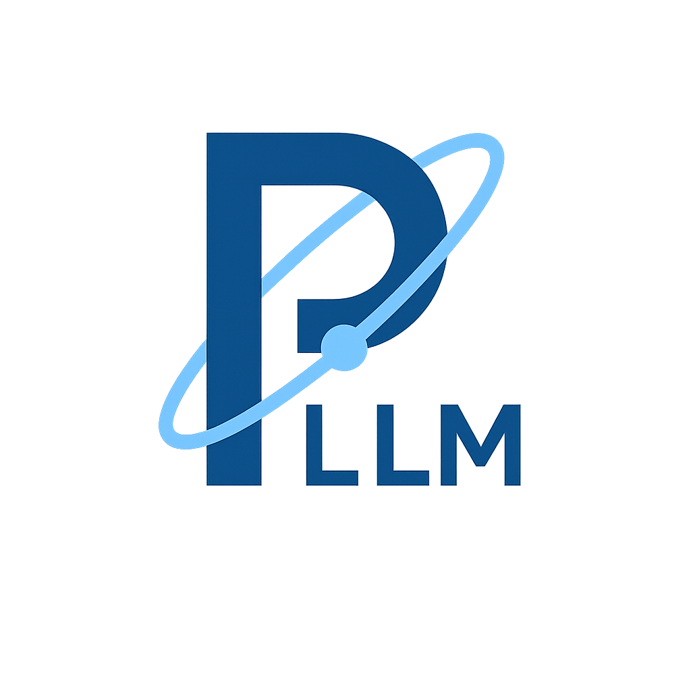
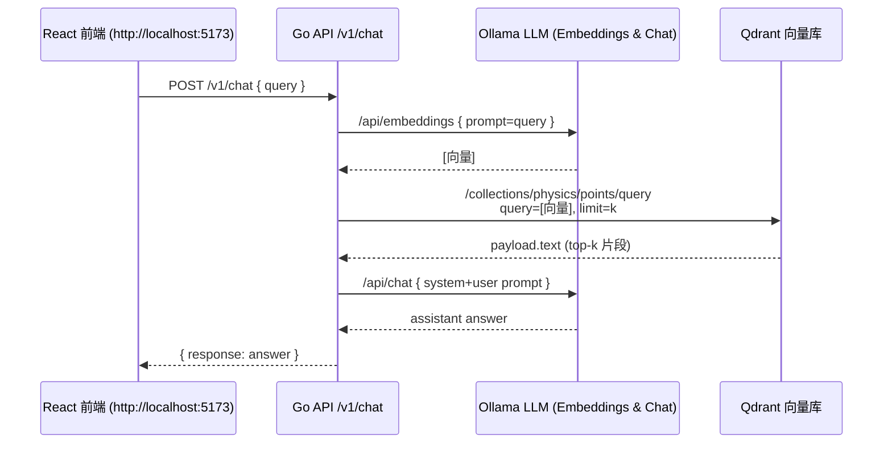

<p align="center">
  
</p>

# Physics-LLM

[](https://github.com/iammm0/physics-llm/releases/tag/v0.0.1)
[](LICENSE)

> 本地离线物理大模型 + 私有知识库 + 向量检索 RAG

## 特性

- **Ollama**：本地 LLM（聊天 + Embedding）
- **Qdrant**：向量数据库
- **Go (Gin)**：REST `/v1/chat` + 自动知识库导入
- **Vite + React (TS)**：前端聊天窗口

---

## 目录结构

```
physics-llm/
├─ cmd/
│  └─ api/                 # HTTP 服务入口 (main.go)
├─ internal/
│  ├─ config/              # 读取 .env / ENV
│  ├─ handler/             # Gin 路由 ( /v1/chat )
│  ├─ ingest/              # 启动时扫描 knowledge/ → Upsert Qdrant
│  ├─ ollama/              # Ollama REST 客户端
│  └─ store/               # Qdrant HTTP 客户端 (Search / Upsert / Ensure)
├─ knowledge/              # 放置 PDF / MD / TXT 等各种文件格式的物理资料
├─ web/                    # React (TS) 前端聊天应用
├─ build-scripts/          # Dockerfiles & compose
└─ README.md
```

---

## 环境变量（.env）

```dotenv
# API
API_ADDR=:8080

# Ollama
OLLAMA_BASE_URL=http://localhost:11434
OLLAMA_MODEL=deepseek-r1:14b
OLLAMA_EMBED_MODEL=mxbai-embed-large

# Qdrant
QDRANT_URL=http://localhost:6333
QDRANT_COLLECTION=physics
EMBED_DIM=1024

# 知识库
KNOWLEDGE_DIR=./knowledge
CHUNK_SIZE=500
CHUNK_OVERLAP=50
```

---

## 启动步骤

```bash
# 1. 拉模型
ollama pull deepseek-r1:14b
ollama pull mxbai-embed-large

# 2. 本地启动 ollama 服务
ollama serve   # 默认在 http://localhost:11434

# 2. 启动 Qdrant
docker compose up -d

# 3. 访问前端
cd frontend && npm install && npm run dev   # http://localhost:5173
```

> **首启自动导入知识库**：
>
> `ingest.Run()` 会扫描 `knowledge/` 目录，将所有 PDF/DOCS/MD/TXT/RMarkDown/JSON/XML/YAML/HTML 提取文本 → 切片 → Embedding → `Upsert` 到 Qdrant。若文件更新，重启服务即可增量导入。

---

## API 快速测试

```bash
curl -H 'Content-Type: application/json' \
     -d '{"query":"解释量子隧穿"}' \
     http://localhost:8080/v1/chat
```

返回示例：

```json
{"response":"量子隧穿是一种…"}
```

---

## 示例关键实现

| 位置                          | 说明                                                        |
| --------------------------- | --------------------------------------------------------- |
| `internal/ingest/ingest.go` | 提取文本（PDF: `ledongthuc/pdf`），切片、生成 UUID、Embedding、`Upsert` |
| `internal/store/qdrant.go`  | `EnsureCollection` + `Search` + `Upsert (PUT)`            |
| `internal/handler/chat.go`  | Embedding → Search → Prompt → Chat (stream\:false)        |
| `internal/ollama/ollama.go` | `/api/embeddings` & `/api/chat` 封装                        |

---

## 时序流程

---

## TODO

* [ ] SSE / WebSocket 流式输出
* [ ] PDF 数学公式 OCR
* [ ] 文档增量更新检测
* [ ] Prometheus /metrics
* [ ] JWT / 角色权限

---

## 许可证

本项目基于 [MIT License](LICENSE) 进行许可。  
© 2025 Mingjun Zhao